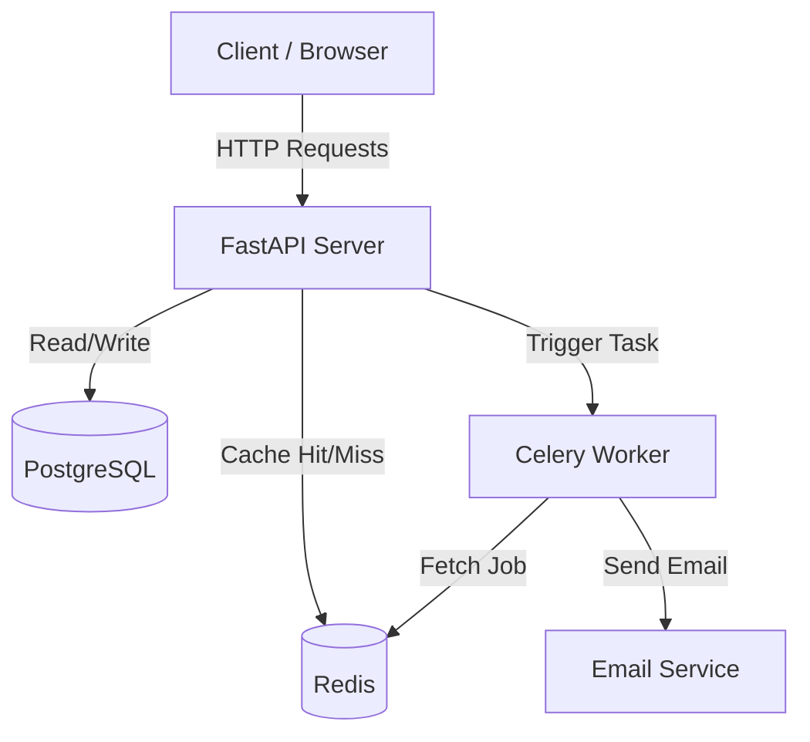
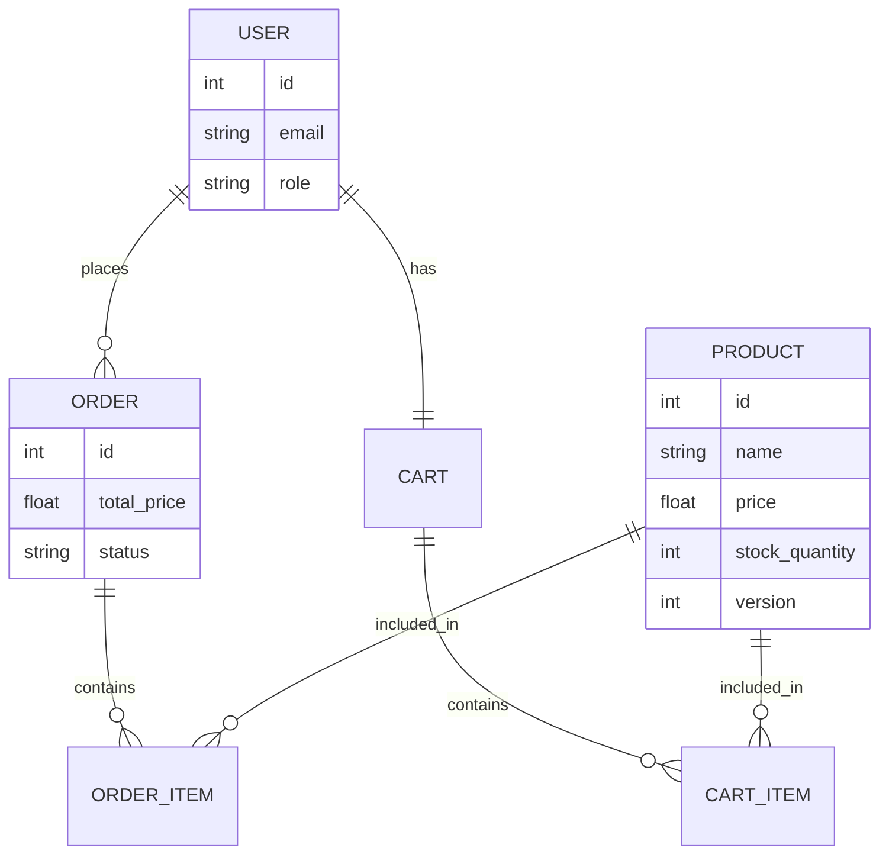

# 🛒 E-Commerce Backend API

A high-performance, scalable E-commerce REST API built with **FastAPI**, **PostgreSQL**, **Redis**, and **Celery**. This system handles high-concurrency orders using **Optimistic Locking** and processes background tasks asynchronously.

## 🚀 Features
* **Authentication:** JWT-based Auth (Admin & Customer roles).
* **Product Management:** CRUD operations with stock management.
* **Shopping Cart:** Add, view, and remove items.
* **Order Processing:** Transactional orders with **Optimistic Locking** (prevents overselling).
* **Performance:** Redis Caching for product listings.
* **Async Tasks:** Background email notifications using Celery & Redis.
* **Containerization:** Fully dockerized setup.

---

## 🏗️ System Architecture
The system follows a microservices-ready architecture using Docker containers.



---

## 🗂️ Database Schema (ERD)
The relationship between Users, Products, Carts, and Orders.



---

## 🛠️ Setup & Installation
Prerequisites
Docker & Docker Compose

Steps to Run

**1.Clone the Repository**
```Bash
git clone [https://github.com/shahanth4444/ecommerce_backend.git](https://github.com/shahanth4444/ecommerce_backend.git)
cd ecommerce_backend
```


**2.Start the Server**
```Bash
docker-compose up --build
```

**3.Access API Documentation**
Open your browser and go to: http://localhost:8000/docs

---

## 🧪 Testing the API
**1. Authentication**

* Register (Admin): POST /register (role: "ADMIN")

* Login: POST /login -> Get Access Token.

* Authorize: Click lock icon 🔒 in Swagger UI and paste token.

**2. Shopping Flow**

1. Create Product: POST /products
2. Add to Cart: POST /cart/items
3. Place Order: POST /orders (Uses items from Cart)

**3. Verification**

* Check Redis Logs for "Serving from Cache".
* Check Celery Logs for "Email Sent".
